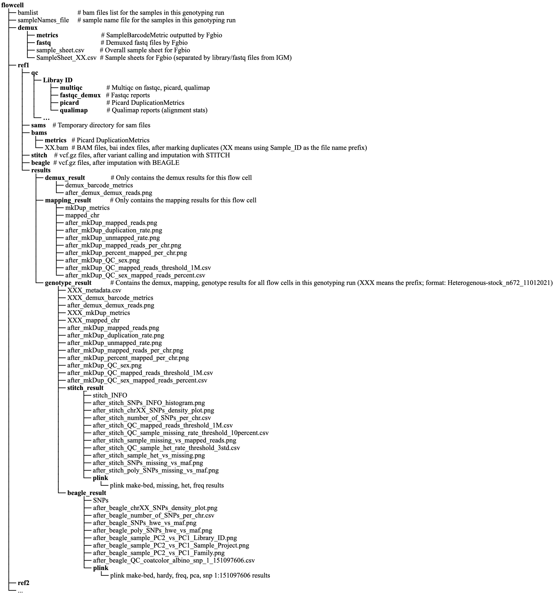

# [Palmer Lab](https://palmerlab.org/) :test_tube: HS Rats Genotyping Pipeline :rat:

## Overview
This [Github repository](https://github.com/Palmer-Lab-UCSD/HS-Rats-Genotyping-Pipeline) is to document Palmer Lab's Heterogeneous Stock Rats Genotyping Pipeline.

## Contents
- **[HPC](HPC)**: This folder contains the complete pipeline code that utilizes HPC's different schedulers' array jobs feature to achieve parallelization.  

## Pipeline Overview

## Pipeline Output Directory Structure

